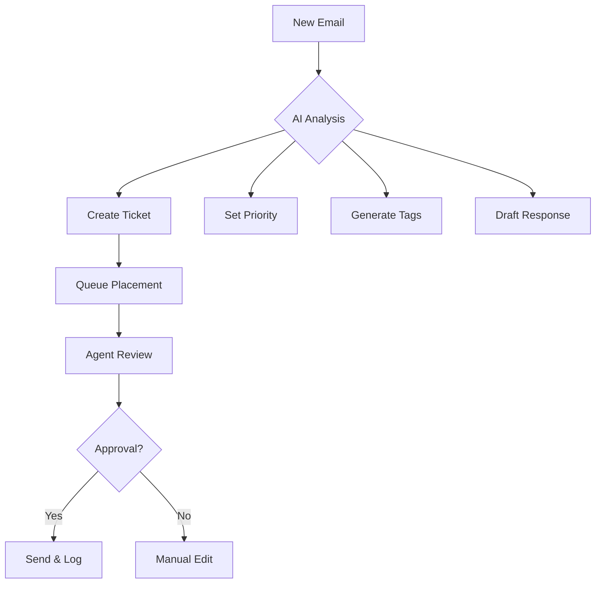

<think>
Okay, let's tackle this user's request. They're building a CRM similar to Zendesk and want to add AI features focused on automation for agents and improving customer experience. They have two ideas already: using RAG for contact insights and automating ticket workflows. The user wants to brainstorm more ideas or refine existing ones, aiming for one or two polished flows.

First, I need to understand their current setup. They mentioned Next.js, TypeScript, Shadcn UI, etc., so the solution should fit into that stack. The project requirements doc they provided gives context on the ticket system, queue management, and administrative controls. The customer features are marked as "DO NOT IMPLEMENT YET," so any new ideas should focus on the agent side for now.

The user's first idea involves RAG to generate contact insights. That's a solid foundation. But how can this be made more actionable for agents? Maybe the insights could directly influence ticket handling, like suggesting responses based on past interactions. Also, ensuring the RAG system is efficient and doesn't slow down the UI is important. Maybe using React cache() for server-side data fetching as per Next.js best practices.

Their second idea automates ticket creation and response generation. This could save agents time. However, the user mentioned wanting refined flows, so perhaps enhancing this with real-time updates or validation steps. For example, using React 19's useActionState for form handling and server actions for mutations. Also, considering error handling if the LLM fails to generate a proper response.

Now, thinking of other ideas. Maybe an AI-assisted collaboration feature where the LLM helps agents draft internal notes or suggests relevant knowledge base articles. Or predictive routing using LLM analysis to assign tickets to the best-suited agent based on content and past performance.

Refining the existing ideas: For the automated workflow, adding a confidence score from the LLM could help agents prioritize which tickets to review first. Also, allowing agents to provide feedback on the AI's suggestions to improve the model over time. Implementing optimistic updates when agents approve responses to make the UI feel faster.

Another angle is proactive support. The LLM could analyze customer interactions to predict issues before they become tickets, allowing agents to reach out preemptively. This would require real-time data processing and maybe integrating with the RAG system for historical context.

Considering the tech stack, using React Server Components where possible to minimize client-side code. For the RAG database, maybe using Supabase or another vector database compatible with Next.js. Ensuring that data fetching is efficient, perhaps using React Query for client-side data management if real-time updates are needed.

Accessibility is important too. Any AI-generated content should be presented in an accessible manner, with proper ARIA labels. Also, handling cases where the LLM might generate incorrect or inappropriate content, so agents can easily correct it.

Testing strategies: Unit tests for the AI integration points, ensuring that the RAG system correctly retrieves relevant info. Integration tests for the automated ticket flow, checking that tags and priorities are set correctly based on email content.

In summary, the key is to enhance the existing ideas with deeper integration into the agent workflow, ensure performance and accessibility, and provide mechanisms for continuous improvement based on agent feedback. Maybe focus on the automated ticket workflow with AI-generated responses and insights, making it as seamless and efficient as possible for agents, while allowing for human oversight and correction.
</think>

Here's a refined approach with strategic AI integration points that build on your ideas while maintaining focus:

### 1. **AI-Coordinated Ticket Resolution Flow** (Your Second Idea Enhanced)
**Problem**: Agents waste time on routine ticket triage and response drafting
**Solution**: End-to-end AI orchestration with human validation



Key enhancements:
- **Context-Aware Response Generation**:
  - Combine RAG with:
    - Customer interaction history
    - Knowledge base articles
    - Internal playbooks
    - Regulatory guidelines
- **Confidence Scoring**:
  ```typescript
  interface AutoResponse {
    content: string
    confidence: number // 0-100 scale
    sources: string[] // KB articles used
    alternativeApproaches: string[]
  }
  ```
- **Agent Experience**:
  - Side-by-side comparison view (AI draft vs manual edit)
  - One-click "Improve This Draft" button for iterative refinement
  - Automated response versioning

### 2. **Predictive Customer Advocacy System** (Building on Your First Idea)
**Problem**: Reactive support misses opportunities for customer retention
**Solution**: AI-driven preemptive engagement

```typescript
// Example type structure for customer insights
interface CustomerHealthScore {
  sentimentTrend: number
  interactionFrequency: number
  issueSeverityHistory: number[]
  potentialChurnRisk: number
  upsellOpportunities: string[]
}

// Sample implementation pattern
export async function generateHealthScore(
  customerId: string
): Promise<CustomerHealthScore> {
  const interactions = await getCustomerInteractions(customerId)
  const tickets = await getResolvedTickets(customerId)
  
  return llmAnalyze({
    systemPrompt: `
      Analyze customer interactions and tickets to:
      1. Identify emerging issues before escalation
      2. Detect subtle sentiment shifts
      3. Flag potential churn risks
      4. Surface upsell opportunities
    `,
    data: { interactions, tickets }
  })
}
```

Agent-facing features:
- **Health Dashboard**: Visualize customer portfolios with risk scores
- **Automated Playbooks**: Suggest proactive check-ins for at-risk accounts
- **Escalation Predictor**: Flag tickets likely to require supervisor attention

### 3. **AI-Assisted Quality Assurance** (New Idea)
**Problem**: Inconsistent support quality and missed improvement opportunities
**Solution**: Real-time conversation coaching

Key components:
- **Live Tone Analysis**: 
  ```typescript
  const toneGuidelines = {
    professionalism: 0.8,
    empathy: 0.7,
    clarity: 0.9
  } as const
  
  export function analyzeResponseQuality(
    draft: string
  ): ToneAssessment {
    return llmClassify({
      systemPrompt: 'Assess response against quality guidelines',
      data: { draft, guidelines: toneGuidelines }
    })
  }
  ```
- **Regulatory Compliance Check**: Automatic flagging of risky language
- **Knowledge Gap Detection**: Identify unanswered questions in thread

### Implementation Strategy

1. **Phased Rollout**:
   - Start with email automation → Add predictive features → Implement QA system

2. **Architecture Considerations**:
   ```mermaid
   flowchart LR
     A[Email Ingestion] --> B[AI Orchestrator]
     B --> C[Vector DB\nCustomer History]
     B --> D[Knowledge Base]
     B --> E[Rules Engine]
     E --> F[Ticket Management]
     E --> G[Response Generator]
   ```

3. **Key Differentiators**:
   - **Closed-Loop Learning**: Agent feedback directly improves models
   - **Contextual Awareness**: Combine real-time analysis with historical data
   - **Assisted Decision Making**: Present options rather than full automation

Would you like me to expand on any particular aspect of these proposals or help prioritize based on your technical constraints?
